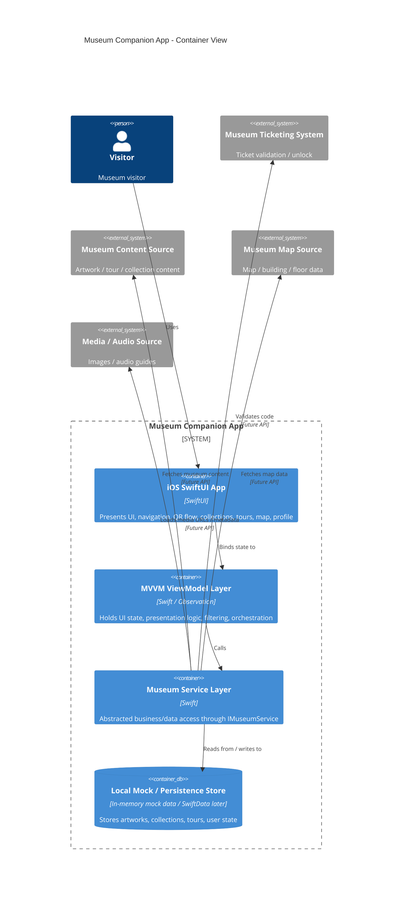

```mermaid
C4Container
title Museum Companion App - Container View

Person(visitor, "Visitor", "Museum visitor")

System_Boundary(appBoundary, "Museum Companion App") {
    Container(mobileApp, "iOS SwiftUI App", "SwiftUI", "Presents UI, navigation, QR flow, collections, tours, map, profile")
    Container(viewModelLayer, "MVVM ViewModel Layer", "Swift / Observation", "Holds UI state, presentation logic, filtering, orchestration")
    Container(serviceLayer, "Museum Service Layer", "Swift", "Abstracted business/data access through IMuseumService")
    ContainerDb(localData, "Local Mock / Persistence Store", "In-memory mock data / SwiftData later", "Stores artworks, collections, tours, user state")
}

System_Ext(ticketSystem, "Museum Ticketing System", "Ticket validation / unlock")
System_Ext(contentSource, "Museum Content Source", "Artwork / tour / collection content")
System_Ext(mapSource, "Museum Map Source", "Map / building / floor data")
System_Ext(mediaSource, "Media / Audio Source", "Images / audio guides")

Rel(visitor, mobileApp, "Uses")

Rel(mobileApp, viewModelLayer, "Binds state to")
Rel(viewModelLayer, serviceLayer, "Calls")
Rel(serviceLayer, localData, "Reads from / writes to")

Rel(serviceLayer, ticketSystem, "Validates code", "Future API")
Rel(serviceLayer, contentSource, "Fetches museum content", "Future API")
Rel(serviceLayer, mapSource, "Fetches map data", "Future API")
Rel(serviceLayer, mediaSource, "Loads media URLs / metadata", "Future API")
```