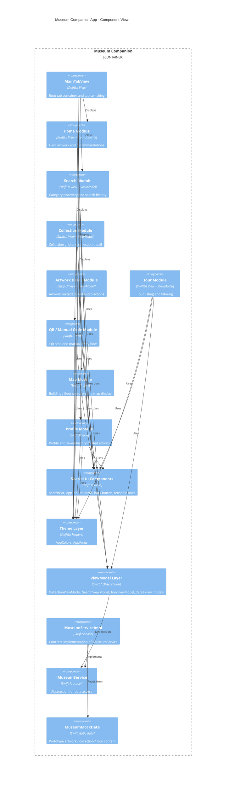

```mermaid
C4Component
title Museum Companion App - Component View 

Container_Boundary(app, "Museum Companion") {
    Component(mainTabView, "MainTabView", "SwiftUI View", "Root tab container and tab switching")
    
    Component(homeModule, "Home Module", "SwiftUI View + Components", "Hero artwork and recommendations")
    Component(searchModule, "Search Module", "SwiftUI View + ViewModel", "Category discovery and search history")
    Component(collectionModule, "Collection Module", "SwiftUI View + ViewModel", "Collection grid and collection detail")
    Component(artworkModule, "Artwork Detail Module", "SwiftUI View + ViewModel", "Artwork metadata and audio actions")
    Component(tourModule, "Tour Module", "SwiftUI View + ViewModel", "Tour listing and filtering")
    Component(qrModule, "QR / Manual Code Module", "SwiftUI View", "QR scan and manual entry flow")
    Component(mapModule, "Map Module", "SwiftUI View", "Building / floor selection and map display")
    Component(profileModule, "Profile Module", "SwiftUI View", "Profile and saved-history related actions")

    Component(sharedUI, "Shared UI Components", "SwiftUI Views", "SearchBar, AppTabBar, cards, back button, reusable rows")
    Component(themeLayer, "Theme Layer", "SwiftUI helpers", "AppColors, AppFonts")
    Component(viewModels, "ViewModel Layer", "Swift / Observation", "CollectionViewModel, SearchViewModel, TourViewModel, detail view models")
    Component(service, "MuseumServiceImpl", "Swift Service", "Concrete implementation of IMuseumService")
    Component(serviceInterface, "IMuseumService", "Swift Protocol", "Abstraction for data access")
    Component(mockData, "MuseumMockData", "Swift static data", "Prototype artwork / collection / tour content")
}

Rel(mainTabView, homeModule, "Displays")
Rel(mainTabView, searchModule, "Displays")
Rel(mainTabView, qrModule, "Displays")
Rel(mainTabView, mapModule, "Displays")
Rel(mainTabView, profileModule, "Displays")

Rel(homeModule, sharedUI, "Uses")
Rel(searchModule, sharedUI, "Uses")
Rel(collectionModule, sharedUI, "Uses")
Rel(artworkModule, sharedUI, "Uses")
Rel(tourModule, sharedUI, "Uses")
Rel(qrModule, sharedUI, "Uses")
Rel(mapModule, sharedUI, "Uses")
Rel(profileModule, sharedUI, "Uses")

Rel(homeModule, themeLayer, "Uses")
Rel(searchModule, themeLayer, "Uses")
Rel(collectionModule, themeLayer, "Uses")
Rel(artworkModule, themeLayer, "Uses")
Rel(tourModule, themeLayer, "Uses")
Rel(qrModule, themeLayer, "Uses")
Rel(mapModule, themeLayer, "Uses")
Rel(profileModule, themeLayer, "Uses")

Rel(searchModule, viewModels, "Uses")
Rel(collectionModule, viewModels, "Uses")
Rel(artworkModule, viewModels, "Uses")
Rel(tourModule, viewModels, "Uses")

Rel(viewModels, serviceInterface, "Depends on")
Rel(service, serviceInterface, "Implements")
Rel(service, mockData, "Reads from")
```