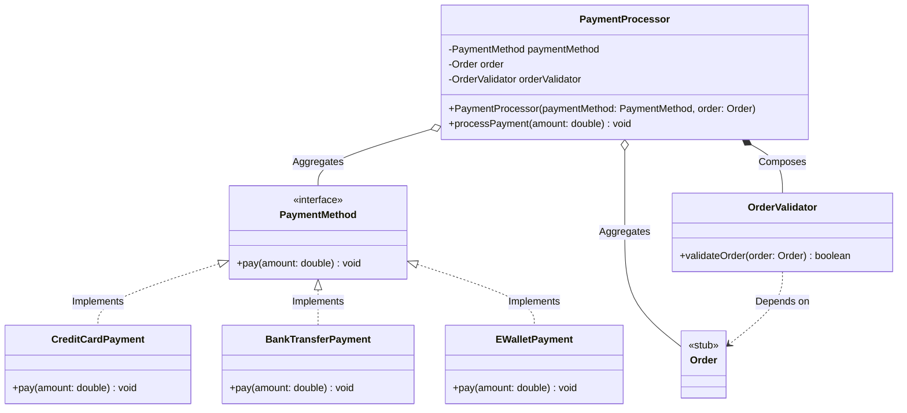

```mermaid
classDiagram
    class PaymentMethod {
        <<interface>>
        +pay(amount: double) void
    }

    class CreditCardPayment {
        +pay(amount: double) void
    }

    class BankTransferPayment {
        +pay(amount: double) void
    }

    class EWalletPayment {
        +pay(amount: double) void
    }

    class PaymentProcessor {
        -PaymentMethod paymentMethod
        -Order order
        -OrderValidator orderValidator
        +PaymentProcessor(paymentMethod: PaymentMethod, order: Order)
        +processPayment(amount: double) void
    }

    class OrderValidator {
        +validateOrder(order: Order) boolean
    }

    class Order {
        <<stub>>
    }

    %% Relationships
    PaymentMethod <|.. CreditCardPayment : Implements
    PaymentMethod <|.. BankTransferPayment : Implements
    PaymentMethod <|.. EWalletPayment : Implements

    PaymentProcessor o-- PaymentMethod : Aggregates
    PaymentProcessor o-- Order : Aggregates
    PaymentProcessor *-- OrderValidator : Composes
    OrderValidator ..> Order : Depends on
```