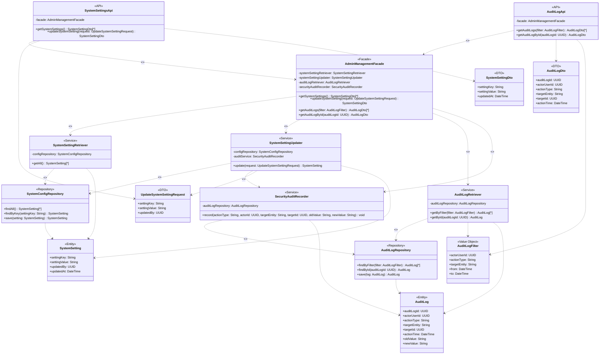

```mermaid
classDiagram
direction TB

%% =========================
%% API LAYER
%% =========================

class SystemSettingsApi {
  <<API>>
  -facade: AdminManagementFacade
  +getSystemSettings() SystemSettingDto[*]
  +updateSystemSetting(request: UpdateSystemSettingRequest) SystemSettingDto
}

class AuditLogApi {
  <<API>>
  -facade: AdminManagementFacade
  +getAuditLogs(filter: AuditLogFilter) AuditLogDto[*]
  +getAuditLogById(auditLogId: UUID) AuditLogDto
}

%% =========================
%% BUSINESS LAYER
%% =========================

class AdminManagementFacade {
  <<Facade>>
  -systemSettingRetriever: SystemSettingRetriever
  -systemSettingUpdater: SystemSettingUpdater
  -auditLogRetriever: AuditLogRetriever
  -securityAuditRecorder: SecurityAuditRecorder
  +getSystemSettings() SystemSettingDto[*]
  +updateSystemSetting(request: UpdateSystemSettingRequest) SystemSettingDto
  +getAuditLogs(filter: AuditLogFilter) AuditLogDto[*]
  +getAuditLogById(auditLogId: UUID) AuditLogDto
}

class SystemSettingRetriever {
  <<Service>>
  -configRepository: SystemConfigRepository
  +getAll() SystemSetting[*]
}

class SystemSettingUpdater {
  <<Service>>
  -configRepository: SystemConfigRepository
  -auditService: SecurityAuditRecorder
  +update(request: UpdateSystemSettingRequest) SystemSetting
}

class AuditLogRetriever {
  <<Service>>
  -auditLogRepository: AuditLogRepository
  +getByFilter(filter: AuditLogFilter) AuditLog[*]
  +getById(auditLogId: UUID) AuditLog
}

class SecurityAuditRecorder {
  <<Service>>
  -auditLogRepository: AuditLogRepository
  +record(actionType: String, actorId: UUID, targetEntity: String, targetId: UUID, oldValue: String, newValue: String) void
}

%% =========================
%% REPOSITORY LAYER
%% =========================

class SystemConfigRepository {
  <<Repository>>
  +findAll() SystemSetting[*]
  +findByKey(settingKey: String) SystemSetting
  +save(setting: SystemSetting) SystemSetting
}

class AuditLogRepository {
  <<Repository>>
  +findByFilter(filter: AuditLogFilter) AuditLog[*]
  +findById(auditLogId: UUID) AuditLog
  +save(log: AuditLog) AuditLog
}

%% =========================
%% DOMAIN / DTO
%% =========================

class SystemSetting {
  <<Entity>>
  +settingKey: String
  +settingValue: String
  +updatedBy: UUID
  +updatedAt: DateTime
}

class AuditLog {
  <<Entity>>
  +auditLogId: UUID
  +actorUserId: UUID
  +actionType: String
  +targetEntity: String
  +targetId: UUID
  +actionTime: DateTime
  +oldValue: String
  +newValue: String
}

class UpdateSystemSettingRequest {
  <<DTO>>
  +settingKey: String
  +settingValue: String
  +updatedBy: UUID
}

class SystemSettingDto {
  <<DTO>>
  +settingKey: String
  +settingValue: String
  +updatedAt: DateTime
}

class AuditLogDto {
  <<DTO>>
  +auditLogId: UUID
  +actorUserId: UUID
  +actionType: String
  +targetEntity: String
  +targetId: UUID
  +actionTime: DateTime
}

class AuditLogFilter {
  <<Value Object>>
  +actorUserId: UUID
  +actionType: String
  +targetEntity: String
  +from: DateTime
  +to: DateTime
}

%% =========================
%% API -> BUSINESS
%% =========================

SystemSettingsApi ..> AdminManagementFacade : <<use>>
AuditLogApi ..> AdminManagementFacade : <<use>>

SystemSettingsApi ..> UpdateSystemSettingRequest
SystemSettingsApi ..> SystemSettingDto
AuditLogApi ..> AuditLogDto
AuditLogApi ..> AuditLogFilter

%% =========================
%% FACADE -> SERVICES
%% =========================

AdminManagementFacade ..> SystemSettingRetriever : <<use>>
AdminManagementFacade ..> SystemSettingUpdater : <<use>>
AdminManagementFacade ..> AuditLogRetriever : <<use>>
AdminManagementFacade ..> SecurityAuditRecorder : <<use>>

%% =========================
%% BUSINESS -> REPOSITORY / DOMAIN
%% =========================

SystemSettingRetriever ..> SystemConfigRepository : <<use>>
SystemSettingRetriever ..> SystemSetting

SystemSettingUpdater ..> SystemConfigRepository : <<use>>
SystemSettingUpdater ..> SecurityAuditRecorder : <<use>>
SystemSettingUpdater ..> UpdateSystemSettingRequest
SystemSettingUpdater ..> SystemSetting

AuditLogRetriever ..> AuditLogRepository : <<use>>
AuditLogRetriever ..> AuditLogFilter
AuditLogRetriever ..> AuditLog

SecurityAuditRecorder ..> AuditLogRepository : <<use>>
SecurityAuditRecorder ..> AuditLog

%% =========================
%% REPOSITORY -> DOMAIN
%% =========================

SystemConfigRepository ..> SystemSetting
AuditLogRepository ..> AuditLog

```