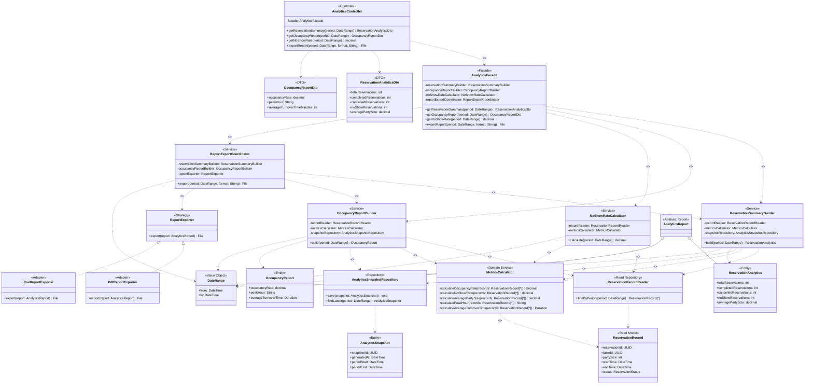

```mermaid
classDiagram
direction TB

%% =========================
%% API LAYER
%% =========================

class AnalyticsController {
  <<Controller>>
  -facade: AnalyticsFacade
  +getReservationSummary(period: DateRange) ReservationAnalyticsDto
  +getOccupancyReport(period: DateRange) OccupancyReportDto
  +getNoShowRate(period: DateRange) decimal
  +exportReport(period: DateRange, format: String) File
}

%% =========================
%% BUSINESS LAYER
%% =========================

class AnalyticsFacade {
  <<Facade>>
  -reservationSummaryBuilder: ReservationSummaryBuilder
  -occupancyReportBuilder: OccupancyReportBuilder
  -noShowRateCalculator: NoShowRateCalculator
  -reportExportCoordinator: ReportExportCoordinator
  +getReservationSummary(period: DateRange) ReservationAnalyticsDto
  +getOccupancyReport(period: DateRange) OccupancyReportDto
  +getNoShowRate(period: DateRange) decimal
  +exportReport(period: DateRange, format: String) File
}

class ReservationSummaryBuilder {
  <<Service>>
  -recordReader: ReservationRecordReader
  -metricsCalculator: MetricsCalculator
  -snapshotRepository: AnalyticsSnapshotRepository
  +build(period: DateRange) ReservationAnalytics
}

class OccupancyReportBuilder {
  <<Service>>
  -recordReader: ReservationRecordReader
  -metricsCalculator: MetricsCalculator
  -snapshotRepository: AnalyticsSnapshotRepository
  +build(period: DateRange) OccupancyReport
}

class NoShowRateCalculator {
  <<Service>>
  -recordReader: ReservationRecordReader
  -metricsCalculator: MetricsCalculator
  +calculate(period: DateRange) decimal
}

class ReportExportCoordinator {
  <<Service>>
  -reservationSummaryBuilder: ReservationSummaryBuilder
  -occupancyReportBuilder: OccupancyReportBuilder
  -reportExporter: ReportExporter
  +export(period: DateRange, format: String) File
}

class MetricsCalculator {
  <<Domain Service>>
  +calculateOccupancyRate(records: ReservationRecord[*]) decimal
  +calculateNoShowRate(records: ReservationRecord[*]) decimal
  +calculateAveragePartySize(records: ReservationRecord[*]) decimal
  +calculatePeakHour(records: ReservationRecord[*]) String
  +calculateAverageTurnoverTime(records: ReservationRecord[*]) Duration
}

%% =========================
%% REPOSITORY LAYER
%% =========================

class ReservationRecordReader {
  <<Read Repository>>
  +findByPeriod(period: DateRange) ReservationRecord[*]
}

class AnalyticsSnapshotRepository {
  <<Repository>>
  +save(snapshot: AnalyticsSnapshot) void
  +findLatest(period: DateRange) AnalyticsSnapshot
}

class ReportExporter {
  <<Strategy>>
  +export(report: AnalyticsReport) File
}

class PdfReportExporter {
  <<Adapter>>
  +export(report: AnalyticsReport) File
}

class CsvReportExporter {
  <<Adapter>>
  +export(report: AnalyticsReport) File
}

%% =========================
%% DOMAIN / DTO
%% =========================

class AnalyticsReport {
  <<Abstract Report>>
}

class ReservationAnalytics {
  <<Entity>>
  +totalReservations: int
  +completedReservations: int
  +cancelledReservations: int
  +noShowReservations: int
  +averagePartySize: decimal
}

class OccupancyReport {
  <<Entity>>
  +occupancyRate: decimal
  +peakHour: String
  +averageTurnoverTime: Duration
}

class AnalyticsSnapshot {
  <<Entity>>
  +snapshotId: UUID
  +generatedAt: DateTime
  +periodStart: DateTime
  +periodEnd: DateTime
}

class ReservationRecord {
  <<Read Model>>
  +reservationId: UUID
  +tableId: UUID
  +partySize: int
  +startTime: DateTime
  +endTime: DateTime
  +status: ReservationStatus
}

class ReservationAnalyticsDto {
  <<DTO>>
  +totalReservations: int
  +completedReservations: int
  +cancelledReservations: int
  +noShowReservations: int
  +averagePartySize: decimal
}

class OccupancyReportDto {
  <<DTO>>
  +occupancyRate: decimal
  +peakHour: String
  +averageTurnoverTimeMinutes: int
}

class DateRange {
  <<Value Object>>
  +from: DateTime
  +to: DateTime
}

%% =========================
%% API -> BUSINESS
%% =========================

AnalyticsController ..> AnalyticsFacade : <<use>>
AnalyticsController ..> ReservationAnalyticsDto
AnalyticsController ..> OccupancyReportDto

%% =========================
%% FACADE -> SERVICES
%% =========================

AnalyticsFacade ..> ReservationSummaryBuilder : <<use>>
AnalyticsFacade ..> OccupancyReportBuilder : <<use>>
AnalyticsFacade ..> NoShowRateCalculator : <<use>>
AnalyticsFacade ..> ReportExportCoordinator : <<use>>

%% =========================
%% BUSINESS -> REPOSITORY / DOMAIN
%% =========================

ReservationSummaryBuilder ..> ReservationRecordReader : <<use>>
ReservationSummaryBuilder ..> MetricsCalculator : <<use>>
ReservationSummaryBuilder ..> AnalyticsSnapshotRepository : <<use>>
ReservationSummaryBuilder ..> ReservationAnalytics
ReservationSummaryBuilder ..> DateRange

OccupancyReportBuilder ..> ReservationRecordReader : <<use>>
OccupancyReportBuilder ..> MetricsCalculator : <<use>>
OccupancyReportBuilder ..> AnalyticsSnapshotRepository : <<use>>
OccupancyReportBuilder ..> OccupancyReport
OccupancyReportBuilder ..> DateRange

NoShowRateCalculator ..> ReservationRecordReader : <<use>>
NoShowRateCalculator ..> MetricsCalculator : <<use>>
NoShowRateCalculator ..> DateRange

ReportExportCoordinator ..> ReservationSummaryBuilder : <<use>>
ReportExportCoordinator ..> OccupancyReportBuilder : <<use>>
ReportExportCoordinator ..> ReportExporter : <<use>>
ReportExportCoordinator ..> DateRange

MetricsCalculator ..> ReservationRecord : <<use>>


ReservationRecordReader ..> ReservationRecord
AnalyticsSnapshotRepository ..> AnalyticsSnapshot


ReportExporter <|.. PdfReportExporter
ReportExporter <|.. CsvReportExporter

AnalyticsReport <|-- ReservationAnalytics
AnalyticsReport <|-- OccupancyReport
```