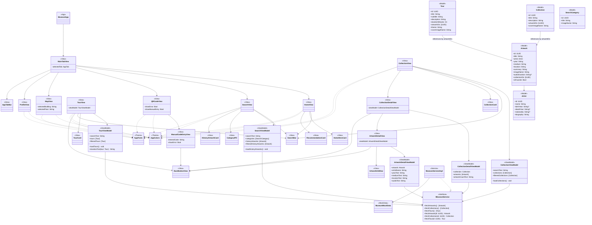

```mermaid
classDiagram
direction TB

class MuseumApp {
  <<App>>
}

class MainTabView {
  <<View>>
  -selectedTab: AppTab
}

class HomeView {
  <<View>>
}

class SearchView {
  <<View>>
}

class CollectionView {
  <<View>>
}

class CollectionDetailView {
  <<View>>
  -viewModel: CollectionDetailViewModel
}

class ArtworkDetailView {
  <<View>>
  -viewModel: ArtworkDetailViewModel
}

class TourView {
  <<View>>
  -viewModel: TourViewModel
}

class QRCodeView {
  <<View>>
  -showError: Bool
  -showManualEntry: Bool
}

class ManualCodeEntryView {
  <<View>>
  -enteredCode: String
  -showError: Bool
}

class MapView {
  <<View>>
  -selectedBuilding: String
  -selectedFloor: String
}

class ProfileView {
  <<View>>
}

class AppTabBar {
  <<View>>
}

class SearchBar {
  <<View>>
}

class CollectionCard {
  <<View>>
}

class TourCard {
  <<View>>
}

class HistoryArtworkCard {
  <<View>>
}

class HomeHeroCard {
  <<View>>
}

class RecommendationCard {
  <<View>>
}

class ArtworkInfoRow {
  <<View>>
}

class CategoryPill {
  <<View>>
}

class BackButtonView {
  <<View>>
}

class CollectionViewModel {
  <<ViewModel>>
  +searchText: String
  +collections: [Collection]
  +filteredCollections: [Collection]
  +loadCollections() void
}

class CollectionDetailViewModel {
  <<ViewModel>>
  +collection: Collection
  +artworks: [Artwork]
  +artworkCountText: String
}

class ArtworkDetailViewModel {
  <<ViewModel>>
  +artwork: Artwork
  +artistName: String
  +yearText: String
  +mediumText: String
  +locationText: String
  +audioText: String
}

class TourViewModel {
  <<ViewModel>>
  +searchText: String
  +tours: [Tour]
  +filteredTours: [Tour]
  +loadTours() void
  +durationText(tour: Tour) String
}

class SearchViewModel {
  <<ViewModel>>
  +searchText: String
  +categories: [SearchCategory]
  +historyArtworks: [Artwork]
  +filteredHistoryArtworks: [Artwork]
  +loadHistoryArtworks() void
}

class IMuseumService {
  <<Interface>>
  +fetchArtworks() [Artwork]
  +fetchCollections() [Collection]
  +fetchTours() [Tour]
  +fetchArtwork(id: UUID) Artwork
  +fetchCollection(id: UUID) Collection
  +fetchTour(id: UUID) Tour
}

class MuseumServiceImpl {
  <<Service>>
}

class MuseumMockData {
  <<MockData>>
}

class Artist {
  <<Model>>
  +id: UUID
  +name: String
  +birthYear: String?
  +deathYear: String?
  +nationality: String?
  +biography: String
}

class Artwork {
  <<Model>>
  +id: UUID
  +title: String
  +artist: Artist
  +year: String
  +medium: String
  +location: String
  +summary: String
  +imageName: String
  +audioDuration: String?
  +collectionIDs: [UUID]
  +isFavorite: Bool
}

class Collection {
  <<Model>>
  +id: UUID
  +title: String
  +description: String
  +artworkIDs: [UUID]
  +coverImageName: String
}

class Tour {
  <<Model>>
  +id: UUID
  +title: String
  +subtitle: String
  +description: String
  +durationMinutes: Int
  +artworkIDs: [UUID]
  +theme: String
  +coverImageName: String
}

class SearchCategory {
  <<Model>>
  +id: UUID
  +title: String
  +imageName: String
}

class AppColors {
  <<Theme>>
}

class AppFonts {
  <<Theme>>
}

MuseumApp --> MainTabView
MainTabView --> HomeView
MainTabView --> SearchView
MainTabView --> QRCodeView
MainTabView --> MapView
MainTabView --> ProfileView
MainTabView --> AppTabBar

HomeView --> SearchBar
HomeView --> HomeHeroCard
HomeView --> RecommendationCard

SearchView --> SearchViewModel
SearchView --> SearchBar
SearchView --> CategoryPill
SearchView --> HistoryArtworkCard

CollectionView --> CollectionViewModel
CollectionView --> SearchBar
CollectionView --> CollectionCard
CollectionView --> CollectionDetailView

CollectionDetailView --> CollectionDetailViewModel
CollectionDetailView --> ArtworkDetailView

ArtworkDetailView --> ArtworkDetailViewModel
ArtworkDetailView --> ArtworkInfoRow

TourView --> TourViewModel
TourView --> TourCard
TourView --> SearchBar

QRCodeView --> ManualCodeEntryView
ManualCodeEntryView --> BackButtonView
CollectionDetailView --> BackButtonView
ArtworkDetailView --> BackButtonView
TourView --> BackButtonView

CollectionViewModel --> IMuseumService
CollectionDetailViewModel --> IMuseumService
ArtworkDetailViewModel --> IMuseumService
TourViewModel --> IMuseumService
SearchViewModel --> IMuseumService

MuseumServiceImpl ..|> IMuseumService
MuseumServiceImpl --> MuseumMockData

Artwork --> Artist
Collection --> Artwork : references by artworkIDs
Tour --> Artwork : references by artworkIDs

HomeView ..> AppColors
HomeView ..> AppFonts
SearchView ..> AppColors
SearchView ..> AppFonts
CollectionView ..> AppColors
CollectionView ..> AppFonts
TourView ..> AppColors
TourView ..> AppFonts
QRCodeView ..> AppColors
QRCodeView ..> AppFonts
MapView ..> AppColors
MapView ..> AppFonts
ProfileView ..> AppColors
ProfileView ..> AppFonts

```