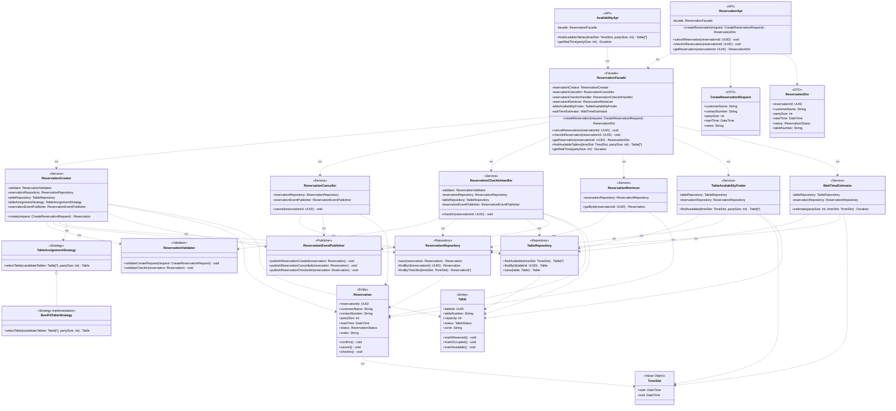

```mermaid
classDiagram
direction TB

%% =========================
%% API LAYER
%% =========================

class ReservationApi {
  <<API>>
  -facade: ReservationFacade
  +createReservation(request: CreateReservationRequest) ReservationDto
  +cancelReservation(reservationId: UUID) void
  +checkInReservation(reservationId: UUID) void
  +getReservation(reservationId: UUID) ReservationDto
}

class AvailabilityApi {
  <<API>>
  -facade: ReservationFacade
  +findAvailableTables(timeSlot: TimeSlot, partySize: int) Table[*]
  +getWaitTime(partySize: int) Duration
}

%% =========================
%% BUSINESS LAYER
%% =========================

class ReservationFacade {
  <<Facade>>
  -reservationCreator: ReservationCreator
  -reservationCanceller: ReservationCanceller
  -reservationCheckInHandler: ReservationCheckInHandler
  -reservationRetriever: ReservationRetriever
  -tableAvailabilityFinder: TableAvailabilityFinder
  -waitTimeEstimator: WaitTimeEstimator
  +createReservation(request: CreateReservationRequest) ReservationDto
  +cancelReservation(reservationId: UUID) void
  +checkInReservation(reservationId: UUID) void
  +getReservation(reservationId: UUID) ReservationDto
  +findAvailableTables(timeSlot: TimeSlot, partySize: int) Table[*]
  +getWaitTime(partySize: int) Duration
}

class ReservationCreator {
  <<Service>>
  -validator: ReservationValidator
  -reservationRepository: ReservationRepository
  -tableRepository: TableRepository
  -tableAssignmentStrategy: TableAssignmentStrategy
  -reservationEventPublisher: ReservationEventPublisher
  +create(request: CreateReservationRequest) Reservation
}

class ReservationCanceller {
  <<Service>>
  -reservationRepository: ReservationRepository
  -reservationEventPublisher: ReservationEventPublisher
  +cancel(reservationId: UUID) void
}

class ReservationCheckInHandler {
  <<Service>>
  -validator: ReservationValidator
  -reservationRepository: ReservationRepository
  -tableRepository: TableRepository
  -reservationEventPublisher: ReservationEventPublisher
  +checkIn(reservationId: UUID) void
}

class ReservationRetriever {
  <<Service>>
  -reservationRepository: ReservationRepository
  +getById(reservationId: UUID) Reservation
}

class TableAvailabilityFinder {
  <<Service>>
  -tableRepository: TableRepository
  -reservationRepository: ReservationRepository
  +findAvailable(timeSlot: TimeSlot, partySize: int) Table[*]
}

class WaitTimeEstimator {
  <<Service>>
  -tableRepository: TableRepository
  -reservationRepository: ReservationRepository
  +estimate(partySize: int, timeSlot: TimeSlot) Duration
}

class ReservationValidator {
  <<Validator>>
  +validateCreateRequest(request: CreateReservationRequest) void
  +validateCheckIn(reservation: Reservation) void
}

class TableAssignmentStrategy {
  <<Strategy>>
  +selectTable(candidateTables: Table[*], partySize: int) Table
}

class BestFitTableStrategy {
  <<Strategy Implementation>>
  +selectTable(candidateTables: Table[*], partySize: int) Table
}

%% =========================
%% REPOSITORY LAYER
%% =========================

class ReservationRepository {
  <<Repository>>
  +save(reservation: Reservation) Reservation
  +findById(reservationId: UUID) Reservation
  +findByTimeSlot(timeSlot: TimeSlot) Reservation[*]
}

class TableRepository {
  <<Repository>>
  +findAvailable(timeSlot: TimeSlot) Table[*]
  +findById(tableId: UUID) Table
  +save(table: Table) Table
}

class ReservationEventPublisher {
  <<Publisher>>
  +publishReservationCreated(reservation: Reservation) void
  +publishReservationCancelled(reservation: Reservation) void
  +publishReservationCheckedIn(reservation: Reservation) void
}

%% =========================
%% DOMAIN / DTO
%% =========================

class Reservation {
  <<Entity>>
  +reservationId: UUID
  +customerName: String
  +contactNumber: String
  +partySize: int
  +startTime: DateTime
  +status: ReservationStatus
  +notes: String
  +confirm() void
  +cancel() void
  +checkIn() void
}

class Table {
  <<Entity>>
  +tableId: UUID
  +tableNumber: String
  +capacity: int
  +status: TableStatus
  +zone: String
  +markReserved() void
  +markOccupied() void
  +markAvailable() void
}

class TimeSlot {
  <<Value Object>>
  +start: DateTime
  +end: DateTime
}

class CreateReservationRequest {
  <<DTO>>
  +customerName: String
  +contactNumber: String
  +partySize: int
  +startTime: DateTime
  +notes: String
}

class ReservationDto {
  <<DTO>>
  +reservationId: UUID
  +customerName: String
  +partySize: int
  +startTime: DateTime
  +status: ReservationStatus
  +tableNumber: String
}

%% =========================
%% API -> BUSINESS
%% =========================

ReservationApi ..> ReservationFacade : <<use>>
AvailabilityApi ..> ReservationFacade : <<use>>

ReservationApi ..> CreateReservationRequest
ReservationApi ..> ReservationDto

%% =========================
%% FACADE -> SERVICES
%% =========================

ReservationFacade ..> ReservationCreator : <<use>>
ReservationFacade ..> ReservationCanceller : <<use>>
ReservationFacade ..> ReservationCheckInHandler : <<use>>
ReservationFacade ..> ReservationRetriever : <<use>>
ReservationFacade ..> TableAvailabilityFinder : <<use>>
ReservationFacade ..> WaitTimeEstimator : <<use>>

%% =========================
%% BUSINESS -> REPOSITORY / DOMAIN
%% =========================

ReservationCreator ..> ReservationValidator : <<use>>
ReservationCreator ..> ReservationRepository : <<use>>
ReservationCreator ..> TableRepository : <<use>>
ReservationCreator ..> TableAssignmentStrategy : <<use>>
ReservationCreator ..> ReservationEventPublisher : <<use>>
ReservationCreator ..> Reservation
ReservationCreator ..> Table

ReservationCanceller ..> ReservationRepository : <<use>>
ReservationCanceller ..> ReservationEventPublisher : <<use>>
ReservationCanceller ..> Reservation

ReservationCheckInHandler ..> ReservationValidator : <<use>>
ReservationCheckInHandler ..> ReservationRepository : <<use>>
ReservationCheckInHandler ..> TableRepository : <<use>>
ReservationCheckInHandler ..> ReservationEventPublisher : <<use>>
ReservationCheckInHandler ..> Reservation
ReservationCheckInHandler ..> Table

ReservationRetriever ..> ReservationRepository : <<use>>
ReservationRetriever ..> Reservation

TableAvailabilityFinder ..> TableRepository : <<use>>
TableAvailabilityFinder ..> ReservationRepository : <<use>>
TableAvailabilityFinder ..> TimeSlot
TableAvailabilityFinder ..> Table

WaitTimeEstimator ..> TableRepository : <<use>>
WaitTimeEstimator ..> ReservationRepository : <<use>>
WaitTimeEstimator ..> TimeSlot

Reservation ..> TimeSlot : <<use>>

%% =========================
%% REPOSITORY -> DOMAIN
%% =========================

ReservationRepository ..> Reservation
TableRepository ..> Table

%% =========================
%% GENERALIZATION / REALIZATION
%% =========================

TableAssignmentStrategy <|.. BestFitTableStrategy

```