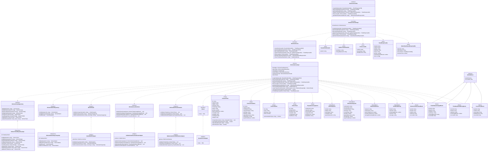

```mermaid
classDiagram
direction TB

class IKitchenController {
  <<Interface>>
  +routeOrderItems(dto: RouteOrderItemsDto): TicketResponseDto[]
  +getTicketsByStation(stationId: string): TicketResponseDto[]
  +getTicketDetail(ticketId: string): TicketResponseDto
  +updateTicketStatus(ticketId: string, dto: UpdateTicketStatusDto): TicketResponseDto
  +fireCourse(dto: FireCourseDto): TicketResponseDto[]
  +getStationDashboard(stationId: string): StationDashboardResponseDto
}

class KitchenControllerImpl {
  <<Controller>>
  -kitchenService: IKitchenService
  +routeOrderItems(dto: RouteOrderItemsDto): TicketResponseDto[]
  +getTicketsByStation(stationId: string): TicketResponseDto[]
  +getTicketDetail(ticketId: string): TicketResponseDto
  +updateTicketStatus(ticketId: string, dto: UpdateTicketStatusDto): TicketResponseDto
  +fireCourse(dto: FireCourseDto): TicketResponseDto[]
  +getStationDashboard(stationId: string): StationDashboardResponseDto
}

class IKitchenService {
  <<Interface>>
  +routeOrderItems(dto: RouteOrderItemsDto): TicketResponseDto[]
  +getTicketsByStation(stationId: string): TicketResponseDto[]
  +getTicketDetail(ticketId: string): TicketResponseDto
  +updateTicketStatus(ticketId: string, dto: UpdateTicketStatusDto): TicketResponseDto
  +fireCourse(dto: FireCourseDto): TicketResponseDto[]
  +getStationDashboard(stationId: string): StationDashboardResponseDto
  +checkTicketDeadline(ticketId: string): DeadlineWarning
}

class KitchenServiceImpl {
  <<Service>>
  -ticketRepo: IKitchenTicketRepository
  -stationRepo: IKitchenStationRepository
  -orderReader: IOrderReader
  -eventPublisher: IKitchenEventPublisher
  -notificationSender: IKitchenNotificationSender
  -clock: IClock
  +routeOrderItems(dto: RouteOrderItemsDto): TicketResponseDto[]
  +getTicketsByStation(stationId: string): TicketResponseDto[]
  +getTicketDetail(ticketId: string): TicketResponseDto
  +updateTicketStatus(ticketId: string, dto: UpdateTicketStatusDto): TicketResponseDto
  +fireCourse(dto: FireCourseDto): TicketResponseDto[]
  +getStationDashboard(stationId: string): StationDashboardResponseDto
  +checkTicketDeadline(ticketId: string): DeadlineWarning
  -createTicketsFromOrder(order: OrderSnapshot, items: OrderItemSnapshot[]): KitchenTicket[]
  -calculateTicketPriority(ticket: KitchenTicket): number
  -toTicketResponse(ticket: KitchenTicket): TicketResponseDto
}

class IKitchenTicketRepository {
  <<Interface>>
  +findById(ticketId: string): KitchenTicket
  +findByStation(stationId: string): KitchenTicket[]
  +findActiveByStation(stationId: string): KitchenTicket[]
  +findByOrderId(orderId: string): KitchenTicket[]
  +save(ticket: KitchenTicket): KitchenTicket
  +saveMany(tickets: KitchenTicket[]): KitchenTicket[]
  +update(ticket: KitchenTicket): KitchenTicket
  +updateStatus(ticketId: string, status: string): KitchenTicket
}

class IKitchenStationRepository {
  <<Interface>>
  +findById(stationId: string): KitchenStation
  +findByDishType(dishType: string): KitchenStation
  +findAllActive(): KitchenStation[]
}

class KitchenTicketRepositoryImpl {
  <<Repository>>
  -db: DatabaseClient
  +findById(ticketId: string): KitchenTicket
  +findByStation(stationId: string): KitchenTicket[]
  +findActiveByStation(stationId: string): KitchenTicket[]
  +findByOrderId(orderId: string): KitchenTicket[]
  +save(ticket: KitchenTicket): KitchenTicket
  +saveMany(tickets: KitchenTicket[]): KitchenTicket[]
  +update(ticket: KitchenTicket): KitchenTicket
  +updateStatus(ticketId: string, status: string): KitchenTicket
  -mapRowToTicket(row: any): KitchenTicket
}

class KitchenStationRepositoryImpl {
  <<Repository>>
  -db: DatabaseClient
  +findById(stationId: string): KitchenStation
  +findByDishType(dishType: string): KitchenStation
  +findAllActive(): KitchenStation[]
  -mapRowToStation(row: any): KitchenStation
}

class IOrderReader {
  <<Interface>>
  +findOrderSnapshot(orderId: string): OrderSnapshot
  +findOrderItems(orderId: string): OrderItemSnapshot[]
  +findCourseItems(orderId: string, courseType: string): OrderItemSnapshot[]
}

class IKitchenEventPublisher {
  <<Interface>>
  +publishTicketCreated(event: KitchenTicketCreatedEvent): void
  +publishTicketStatusChanged(event: TicketStatusChangedEvent): void
  +publishDeadlineWarning(event: TicketDeadlineWarningEvent): void
  +publishCourseFired(event: CourseFiredEvent): void
}

class IKitchenNotificationSender {
  <<Interface>>
  +notifyNewTicket(ticket: KitchenTicket): void
  +notifyStatusChanged(ticket: KitchenTicket): void
  +notifyDeadlineWarning(warning: DeadlineWarning): void
}

class IClock {
  <<Interface>>
  +now(): Date
}

class OrderReaderAdapter {
  <<Adapter>>
  -orderClient: OrderServiceClient
  +findOrderSnapshot(orderId: string): OrderSnapshot
  +findOrderItems(orderId: string): OrderItemSnapshot[]
  +findCourseItems(orderId: string, courseType: string): OrderItemSnapshot[]
}

class KafkaKitchenEventPublisherAdapter {
  <<Adapter>>
  -producer: KafkaProducer
  +publishTicketCreated(event: KitchenTicketCreatedEvent): void
  +publishTicketStatusChanged(event: TicketStatusChangedEvent): void
  +publishDeadlineWarning(event: TicketDeadlineWarningEvent): void
  +publishCourseFired(event: CourseFiredEvent): void
}

class WebSocketKitchenNotificationAdapter {
  <<Adapter>>
  -gateway: WebSocketGateway
  +notifyNewTicket(ticket: KitchenTicket): void
  +notifyStatusChanged(ticket: KitchenTicket): void
  +notifyDeadlineWarning(warning: DeadlineWarning): void
}

class SystemClockAdapter {
  <<Adapter>>
  +now(): Date
}

class KitchenTicket {
  <<Entity>>
  +id: string
  +orderId: string
  +tableId: string
  +stationId: string
  +courseType: string
  +status: string
  +priority: number
  +prepTimeMinutes: number
  +createdAt: Date
  +startedAt: Date
  +cookingAt: Date
  +readyAt: Date
  +changeStatus(status: string, changedAt: Date): void
  +calculateRemainingTime(now: Date): number
  +isNearDeadline(now: Date): boolean
  +isOverdue(now: Date): boolean
}

class KitchenTicketItem {
  <<Entity>>
  +id: string
  +ticketId: string
  +orderItemId: string
  +menuItemName: string
  +dishType: string
  +quantity: number
  +specialInstruction: string
  +allergyTags: string[]
  +prepTimeMinutes: number
}

class KitchenStation {
  <<Entity>>
  +id: string
  +name: string
  +dishType: string
  +active: boolean
  +canHandle(dishType: string): boolean
}

class KitchenTask {
  <<Entity>>
  +id: string
  +ticketId: string
  +deadlineTime: Date
  +startedAt: Date
  +completedAt: Date
  +taskStatus: string
}

class PreparationAssignment {
  <<Entity>>
  +orderItemId: string
  +stationId: string
  +kitchenStaffId: string
  +assignedAt: Date
  +priorityLevel: number
  +prepStatus: string
}

class OrderSnapshot {
  <<ValueObject>>
  +orderId: string
  +tableId: string
  +orderStatus: string
  +createdAt: Date
  +specialInstruction: string
}

class OrderItemSnapshot {
  <<ValueObject>>
  +orderItemId: string
  +menuItemId: string
  +menuItemName: string
  +dishType: string
  +courseType: string
  +quantity: number
  +specialInstruction: string
  +allergyTags: string[]
  +prepTimeMinutes: number
}

class StationDashboard {
  <<ValueObject>>
  +stationId: string
  +stationName: string
  +activeTicketCount: number
  +overdueTicketCount: number
  +averageRemainingMinutes: number
}

class DeadlineWarning {
  <<ValueObject>>
  +ticketId: string
  +stationId: string
  +remainingMinutes: number
  +severity: string
  +message: string
}

class KitchenEvent {
  <<Abstract>>
  +eventId: string
  +occurredAt: Date
}

class KitchenTicketCreatedEvent {
  <<Event>>
  +eventId: string
  +ticketId: string
  +orderId: string
  +stationId: string
  +occurredAt: Date
}

class TicketStatusChangedEvent {
  <<Event>>
  +eventId: string
  +ticketId: string
  +oldStatus: string
  +newStatus: string
  +changedByUserId: string
  +occurredAt: Date
}

class TicketDeadlineWarningEvent {
  <<Event>>
  +eventId: string
  +ticketId: string
  +stationId: string
  +remainingMinutes: number
  +occurredAt: Date
}

class CourseFiredEvent {
  <<Event>>
  +eventId: string
  +orderId: string
  +courseType: string
  +firedByUserId: string
  +occurredAt: Date
}

class RouteOrderItemsDto {
  <<DTO>>
  +orderId: string
}

class UpdateTicketStatusDto {
  <<DTO>>
  +newStatus: string
  +changedByUserId: string
}

class FireCourseDto {
  <<DTO>>
  +orderId: string
  +courseType: string
  +firedByUserId: string
}

class TicketResponseDto {
  <<DTO>>
  +ticketId: string
  +orderId: string
  +tableId: string
  +stationId: string
  +status: string
  +priority: number
  +remainingTimeMinutes: number
  +items: string[]
}

class StationDashboardResponseDto {
  <<DTO>>
  +stationId: string
  +stationName: string
  +activeTickets: TicketResponseDto[]
  +overdueCount: number
}

IKitchenController <|.. KitchenControllerImpl
KitchenControllerImpl ..> IKitchenService

IKitchenService <|.. KitchenServiceImpl

KitchenServiceImpl ..> IKitchenTicketRepository
KitchenServiceImpl ..> IKitchenStationRepository
KitchenServiceImpl ..> IOrderReader
KitchenServiceImpl ..> IKitchenEventPublisher
KitchenServiceImpl ..> IKitchenNotificationSender
KitchenServiceImpl ..> IClock

IKitchenTicketRepository <|.. KitchenTicketRepositoryImpl
IKitchenStationRepository <|.. KitchenStationRepositoryImpl

IOrderReader <|.. OrderReaderAdapter
IKitchenEventPublisher <|.. KafkaKitchenEventPublisherAdapter
IKitchenNotificationSender <|.. WebSocketKitchenNotificationAdapter
IClock <|.. SystemClockAdapter

KitchenEvent <|-- KitchenTicketCreatedEvent
KitchenEvent <|-- TicketStatusChangedEvent
KitchenEvent <|-- TicketDeadlineWarningEvent
KitchenEvent <|-- CourseFiredEvent

KitchenControllerImpl ..> RouteOrderItemsDto
KitchenControllerImpl ..> UpdateTicketStatusDto
KitchenControllerImpl ..> FireCourseDto
KitchenControllerImpl ..> TicketResponseDto
KitchenControllerImpl ..> StationDashboardResponseDto

KitchenServiceImpl ..> KitchenTicket
KitchenServiceImpl ..> KitchenTicketItem
KitchenServiceImpl ..> KitchenStation
KitchenServiceImpl ..> KitchenTask
KitchenServiceImpl ..> PreparationAssignment
KitchenServiceImpl ..> OrderSnapshot
KitchenServiceImpl ..> OrderItemSnapshot
KitchenServiceImpl ..> StationDashboard
KitchenServiceImpl ..> DeadlineWarning
KitchenServiceImpl ..> KitchenTicketCreatedEvent
KitchenServiceImpl ..> TicketStatusChangedEvent
KitchenServiceImpl ..> TicketDeadlineWarningEvent
KitchenServiceImpl ..> CourseFiredEvent
```