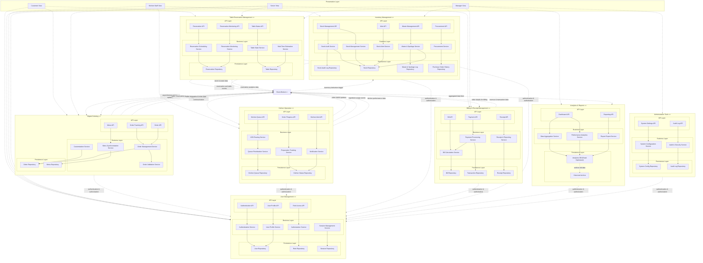

```mermaid
flowchart TB

%% ===== Presentation Layer =====
subgraph PL["Presentation Layer"]
    CV["Customer View"]
    SV["Server View"]
    KV["Kitchen Staff View"]
    MV["Manager View"]
end

%% ===== 1. User Management =====
subgraph UM["User Management <<module>>"]
direction TB

    subgraph UM_API["API Layer"]
        UMA1["Authentication API"]
        UMA2["User Profile API"]
        UMA3["Role Access API"]
    end

    subgraph UM_BUS["Business Layer"]
        UMB1["Authentication Service"]
        UMB2["Authorization Service"]
        UMB3["Session Management Service"]
        UMB4["User Profile Service"]
    end

    subgraph UM_PER["Persistence Layer"]
        UMP1["User Repository"]
        UMP2["Role Repository"]
        UMP3["Session Repository"]
    end

    UMA1 --> UMB1
    UMA2 --> UMB4
    UMA3 --> UMB2

    UMB1 --> UMP1
    UMB2 --> UMP2
    UMB3 --> UMP3
    UMB4 --> UMP1
end

%% ===== 2. Digital Ordering =====
subgraph DO["Digital Ordering <<module>>"]
direction TB

    subgraph DO_API["API Layer"]
        DOA1["Order API"]
        DOA2["Menu API"]
        DOA3["Order Tracking API"]
    end

    subgraph DO_BUS["Business Layer"]
        DOB1["Order Management Service"]
        DOB2["Menu Synchronization Service"]
        DOB3["Order Validation Service"]
        DOB4["Customization Service"]
    end

    subgraph DO_PER["Persistence Layer"]
        DOP1["Order Repository"]
        DOP2["Menu Repository"]
    end

    DOA1 --> DOB1
    DOA2 --> DOB2
    DOA3 --> DOB1

    DOB1 --> DOB3
    DOB1 --> DOP1
    DOB2 --> DOP2
    DOB4 --> DOP1
end

%% ===== 3. Kitchen Operation =====
subgraph KO["Kitchen Operation <<module>>"]
direction TB

    subgraph KO_API["API Layer"]
        KOA1["Kitchen Queue API"]
        KOA2["Order Progress API"]
        KOA3["Kitchen Alert API"]
    end

    subgraph KO_BUS["Business Layer"]
        KOB1["KDS Routing Service"]
        KOB2["Queue Prioritization Service"]
        KOB3["Preparation Tracking Service"]
        KOB4["Notification Service"]
    end

    subgraph KO_PER["Persistence Layer"]
        KOP1["Kitchen Queue Repository"]
        KOP2["Kitchen Status Repository"]
    end

    KOA1 --> KOB1
    KOA2 --> KOB3
    KOA3 --> KOB4

    KOB1 --> KOB2
    KOB2 --> KOP1
    KOB3 --> KOP2
    KOB4 --> KOP2
end

%% ===== 4. Table Reservation Management =====
subgraph TR["Table Reservation Management <<module>>"]
direction TB

    subgraph TR_API["API Layer"]
        TRA1["Reservation API"]
        TRA2["Table Status API"]
        TRA3["Reservation Monitoring API"]
    end

    subgraph TR_BUS["Business Layer"]
        TRB1["Reservation Scheduling Service"]
        TRB2["Reservation Monitoring Service"]
        TRB3["Table State Service"]
        TRB4["Wait Time Estimation Service"]
    end

    subgraph TR_PER["Persistence Layer"]
        TRP1["Reservation Repository"]
        TRP2["Table Repository"]
    end

    TRA1 --> TRB1
    TRA2 --> TRB3
    TRA3 --> TRB2

    TRB1 --> TRP1
    TRB2 --> TRP1
    TRB3 --> TRP2
    TRB4 --> TRP2
end

%% ===== 5. Billing Module =====
subgraph BM["Billing & Receipt Management <<module>>"]
direction TB
    subgraph BM_API["API Layer"]
        BMA1["Bill API"]
        BMA2["Payment API"]
        BMA3["Receipt API"]
    end
    subgraph BM_BUS["Business Layer"]
        BMB1["Bill Calculation Service"]
        BMB2["Payment Processing Service"]
        BMB3["Receipt & Reporting Service"]
    end
    subgraph BM_PER["Persistence Layer"]
        BMP1["Bill Repository"]
        BMP2["Transaction Repository"]
        BMP3["Receipt Repository"]
    end

    %% API to Business
    BMA1 --> BMB1
    BMA2 --> BMB2
    BMA3 --> BMB3

    %% Business to Persistence
    BMB1 --> BMP1
    BMB2 --> BMP2
    BMB3 --> BMP3

    %% Intra-business interactions
    BMB2 --> BMB1
    
end

%% ===== 6. Inventory Module =====
subgraph IM["Inventory Management <<module>>"]
direction TB
    subgraph IM_API["API Layer"]
        IMA1["Stock Management API"]
        IMA2["Alert API"]
        IMA3["Waste Management API"]
        IMA4["Procurement API"]
    end
    
    subgraph IM_BUS["Business Layer"]
        IMB1["Stock Management Service"]
        IMB2["Stock Audit Service"]
        IMB3["Stock Alert Service"]
        IMB4["Waste & Spoilage Service"]
        IMB5["Procurement Service"]
    end
    
    subgraph IM_PER["Persistence Layer"]
        IMP1["Stock Repository"]
        IMP2["Stock Audit Log Repository"]
        IMP3["Waste & Spoilage Log Repository"]
        IMP4["Purchase Order History Repository"]
    end

    %% API to Business
    IMA1 --> IMB1
    IMA1 --> IMB2
    IMA2 --> IMB3
    IMA3 --> IMB4
    IMA4 --> IMB5

    %% Business to Persistence
    IMB1 --> IMP1
    IMB2 --> IMP1
    IMB2 --> IMP2
    IMB3 --> IMP1
    IMB4 --> IMP1
    IMB4 --> IMP3
    IMB5 --> IMP4
end

%% ===== 7. Analytics & Reports Module =====
subgraph AR["Analytics & Reports <<module>>"]
direction TB
    subgraph AR_API["API Layer"]
        ARA1["Reporting API"]
        ARA2["Dashboard API"]
    end
    
    subgraph AR_BUS["Business Layer"]
        ARB1["Data Aggregation Service"]
        ARB2["Performance Analytics Service"]
        ARB3["Report Export Service"]
    end
    
    subgraph AR_PER["Persistence Layer"]
        ARP1["Analytics DB (Read-Optimized)"]
        ARP2["Historical Archive"]
    end
    
    %% Connections
    ARA1 --> ARB3

    ARA2 --> ARB1
    ARA2 --> ARB2

    ARB1 --> ARP1
    ARB2 --> ARP1
    ARB3 --> ARP1

    ARP1 -. archive old data .-> ARP2
end

%% ===== 8. Administrative Tools Module =====
subgraph AT["Administrative Tools <<module>>"]
direction TB
    subgraph AT_API["API Layer"]
        ATA1["System Settings API"]
        ATA2["Audit Log API"]
    end
    
    subgraph AT_BUS["Business Layer"]
        ATB1["System Configuration Service"]
        ATB2["Audit & Security Service"]
    end
    
    subgraph AT_PER["Persistence Layer"]
        ATP1["System Config Repository"]
        ATP2["Audit Log Repository"]
    end
    
    ATA1 --> ATB1
    ATA2 --> ATB2
    
    ATB1 --> ATP1
    ATB2 --> ATP2
end

%% ===== Communication Backbone =====
ECB["Event Broker<<infrastructure>>"]

%% ===== Presentation dependencies =====
CV -.-> DO
CV -.-> TR
CV -.-> UM

SV -.-> DO
SV -.-> TR
SV -.-> UM
SV -.-> BM

KV -.-> KO
KV -.-> IM
KV -.-> UM

MV -.-> TR
MV -.-> BM
MV -.-> IM
MV -.-> AR
MV -.-> AT
MV -.-> UM

%% ===== Shared identity/access dependencies =====
DO -. "authentication & authorization" .-> UM
KO -. "authentication & authorization" .-> UM
TR -. "authentication & authorization" .-> UM
BM -. "authentication & authorization" .-> UM
IM -. "authentication & authorization" .-> UM
AR -. "authentication & authorization" .-> UM
AT -. "authentication & authorization" .-> UM

%% ===== Event-driven interactions =====
%% ===== 1. Order Events =====
DO -. "order events" .-> ECB
ECB -. "asynchronous order communication" .-> KO

%% ===== 2. Order Status Events =====
KO -. "order status updates" .-> ECB
ECB -. "asynchronous status updates" .-> DO

%% ===== 3. Reservation Events =====
TR -. "reservation and table events" .-> ECB
ECB -. "table / reservation updates" .-> DO

%% ===== 4. Billing Events =====
DO -. "order details for billing" .-> ECB
ECB -. "order details for billing" .-> BM

%% ===== 5. Stock Deduction From Kitchen =====
KO -. "ingredient usage events" .-> ECB
ECB -. "inventory deduction trigger" .-> IM

%% ===== 6. Data Feeds to Analytics =====
DO -. "sales & order data" .-> ECB
KO -. "kitchen performance data" .-> ECB
BM -. "revenue & transaction data" .-> ECB
IM -. "stock & waste data" .-> ECB
TR -. "reservation analytics data" .-> ECB
ECB -. "aggregated data feed" .-> AR
```