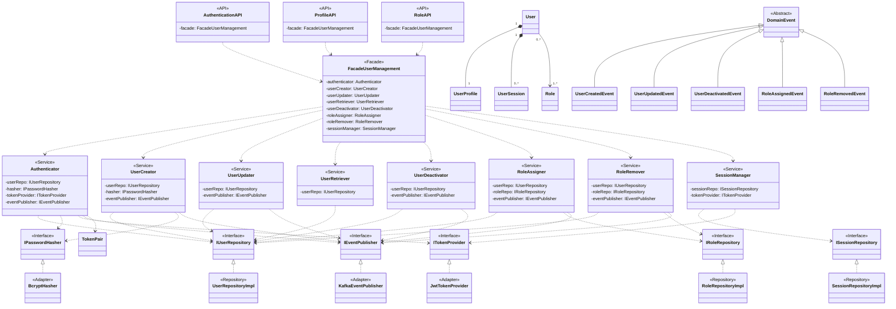

```mermaid


classDiagram
direction TB

%% =========================
%% API LAYER
%% =========================

class AuthenticationAPI {
  <<API>>
  -facade: FacadeUserManagement
}

class ProfileAPI {
  <<API>>
  -facade: FacadeUserManagement
}

class RoleAPI {
  <<API>>
  -facade: FacadeUserManagement
}

%% =========================
%% BUSINESS LAYER
%% =========================

class FacadeUserManagement {
  <<Facade>>
  -authenticator: Authenticator
  -userCreator: UserCreator
  -userUpdater: UserUpdater
  -userRetriever: UserRetriever
  -userDeactivator: UserDeactivator
  -roleAssigner: RoleAssigner
  -roleRemover: RoleRemover
  -sessionManager: SessionManager
}

class Authenticator {
  <<Service>>
  -userRepo: IUserRepository
  -hasher: IPasswordHasher
  -tokenProvider: ITokenProvider
  -eventPublisher: IEventPublisher
}

class UserCreator {
  <<Service>>
  -userRepo: IUserRepository
  -hasher: IPasswordHasher
  -eventPublisher: IEventPublisher
}

class UserUpdater {
  <<Service>>
  -userRepo: IUserRepository
  -eventPublisher: IEventPublisher
}

class UserRetriever {
  <<Service>>
  -userRepo: IUserRepository
}

class UserDeactivator {
  <<Service>>
  -userRepo: IUserRepository
  -eventPublisher: IEventPublisher
}

class RoleAssigner {
  <<Service>>
  -userRepo: IUserRepository
  -roleRepo: IRoleRepository
  -eventPublisher: IEventPublisher
}

class RoleRemover {
  <<Service>>
  -userRepo: IUserRepository
  -roleRepo: IRoleRepository
  -eventPublisher: IEventPublisher
}

class SessionManager {
  <<Service>>
  -sessionRepo: ISessionRepository
  -tokenProvider: ITokenProvider
}

class ITokenProvider {
  <<Interface>>
}

class IPasswordHasher {
  <<Interface>>
}

class IEventPublisher {
  <<Interface>>
}

%% =========================
%% REPOSITORY LAYER
%% =========================

class IUserRepository {
  <<Interface>>
}

class IRoleRepository {
  <<Interface>>
}

class ISessionRepository {
  <<Interface>>
}

class UserRepositoryImpl {
  <<Repository>>
}

class RoleRepositoryImpl {
  <<Repository>>
}

class SessionRepositoryImpl {
  <<Repository>>
}

class JwtTokenProvider {
  <<Adapter>>
}

class BcryptHasher {
  <<Adapter>>
}

class KafkaEventPublisher {
  <<Adapter>>
}

%% =========================
%% DOMAIN
%% =========================

class User
class UserProfile
class UserSession
class Role
class TokenPair

class DomainEvent {
  <<Abstract>>
}

class UserCreatedEvent
class UserUpdatedEvent
class UserDeactivatedEvent
class RoleAssignedEvent
class RoleRemovedEvent

%% =========================
%% API -> BUSINESS
%% =========================

AuthenticationAPI ..> FacadeUserManagement
ProfileAPI ..> FacadeUserManagement
RoleAPI ..> FacadeUserManagement

%% =========================
%% FACADE -> SERVICES
%% =========================

FacadeUserManagement ..> Authenticator
FacadeUserManagement ..> UserCreator
FacadeUserManagement ..> UserUpdater
FacadeUserManagement ..> UserRetriever
FacadeUserManagement ..> UserDeactivator
FacadeUserManagement ..> RoleAssigner
FacadeUserManagement ..> RoleRemover
FacadeUserManagement ..> SessionManager

%% =========================
%% BUSINESS -> REPOSITORY / INFRA
%% =========================

Authenticator ..> IUserRepository
Authenticator ..> IPasswordHasher
Authenticator ..> ITokenProvider
Authenticator ..> IEventPublisher
Authenticator ..> TokenPair

UserCreator ..> IUserRepository
UserCreator ..> IPasswordHasher
UserCreator ..> IEventPublisher

UserUpdater ..> IUserRepository
UserUpdater ..> IEventPublisher

UserRetriever ..> IUserRepository

UserDeactivator ..> IUserRepository
UserDeactivator ..> IEventPublisher

RoleAssigner ..> IUserRepository
RoleAssigner ..> IRoleRepository
RoleAssigner ..> IEventPublisher

RoleRemover ..> IUserRepository
RoleRemover ..> IRoleRepository
RoleRemover ..> IEventPublisher

SessionManager ..> ISessionRepository
SessionManager ..> ITokenProvider

%% =========================
%% REALIZATION
%% =========================

IUserRepository <|.. UserRepositoryImpl
IRoleRepository <|.. RoleRepositoryImpl
ISessionRepository <|.. SessionRepositoryImpl

ITokenProvider <|.. JwtTokenProvider
IPasswordHasher <|.. BcryptHasher
IEventPublisher <|.. KafkaEventPublisher

DomainEvent <|-- UserCreatedEvent
DomainEvent <|-- UserUpdatedEvent
DomainEvent <|-- UserDeactivatedEvent
DomainEvent <|-- RoleAssignedEvent
DomainEvent <|-- RoleRemovedEvent

%% =========================
%% DOMAIN RELATIONSHIPS
%% =========================

User "1" *-- "1" UserProfile
User "1" *-- "0..*" UserSession
User "0..*" --> "1..*" Role


```